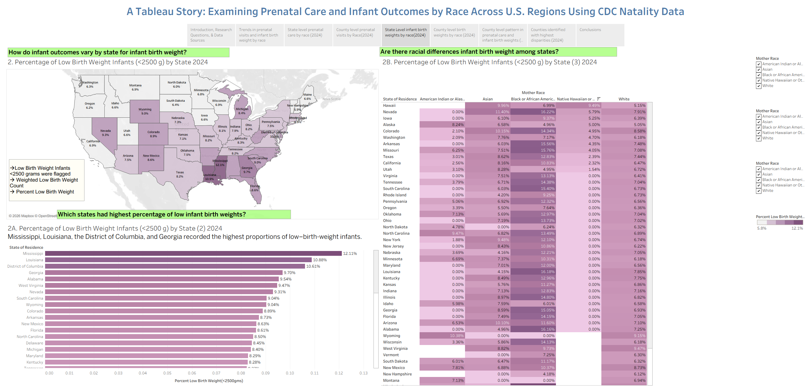
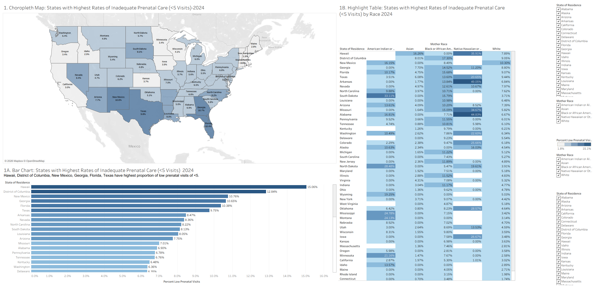

# Examining Prenatal Care and Infant Outcomes by Race Across U.S. Regions Using CDC Natality Data
## Interactive Tableau Workbook

Download the Tableau packaged workbook below to explore the full interactive dashboards and story analysis.

---
## Project Overview
This Tableau visualization project examines racial and geographic disparities in prenatal care utilization and infant birth outcomes across the United States using CDC Natality data.

The project explores how prenatal care access varies by race and region and investigates how these differences relate to infant birth outcomes, particularly low birth weight.

---

## Research Questions
1. How does prenatal care access vary by race and region?
2. How do infant birth outcomes vary across racial groups and geographic regions?
3. What relationship exists between prenatal care utilization and infant birth weight?
4. Which U.S. regions exhibit the greatest disparities?

---

## Data Sources
CDC WONDER – National Vital Statistics System (NVSS) Natality Data

Datasets used:
- Prenatal Visits by Race and Geography (2024)
- Infant Birth Weight and Survival by Race (2024)
- Prenatal Visits and Infant Outcomes by Year (2016–2024)

---

## Tools Used
- Tableau Desktop
- Tableau Prep Builder
- CDC WONDER Natality Data

---

## Visualizations Included
- Trend analysis (2016–2024)
- State-level racial disparities
- County-level choropleth maps
- Prenatal care utilization dashboards
- Low birth weight dashboards
- Correlation analysis between prenatal care and infant outcomes

---
## Tableau Story Overview

---

## Dashboard A — National Trends in Prenatal Care and Infant Outcomes

---

## Dashboard B — State-Level Prenatal Care Disparities

---

## Dashboard C — County-Level Prenatal Care Disparities

---

## Dashboard D — State-Level Low Birth Weight Disparities

---

## Dashboard E — County-Level Low Birth Weight Disparities

---

## Dashboard F — Prenatal Care and Infant Outcome Correlation

---

## Dashboard G — High-Disparity Counties

---

## Key Findings
- Southern U.S. regions showed the highest rates of inadequate prenatal care and low birth weight.
- Black/African American mothers experienced the highest rates of low birth weight.
- Native Hawaiian and American Indian mothers showed the lowest prenatal care utilization in several regions.
- Counties with low prenatal care generally corresponded to higher low-birth-weight rates.

---

## Files
- `.twbx` Tableau packaged workbook
- PDF presentation/report
- README documentation

---

## Skills Demonstrated
- Tableau dashboards
- Tableau Storytelling
- Geographic visualization
- Public health analytics
- Health disparities analysis
- CDC data analysis
- Data cleaning and preparation
- Choropleth mapping

---

## Author
Divya Verma
MS Health Informatics
Rutgers University
